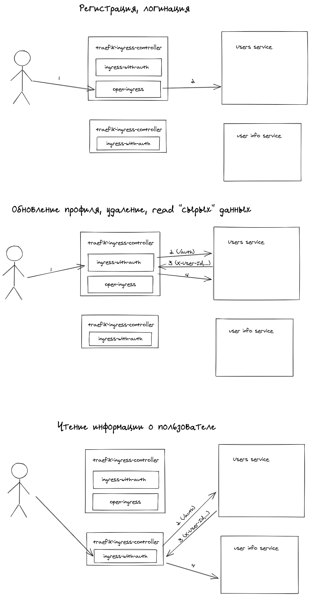

Схема решения


Для запуска выполняем следующий набор команд:

1) Запустите k8s

2) Добавьте namespace arch-course
```
kubectl create namespace arch-course && kubens arch-course
```

3) Запустите приложение
```
make start
```

4) Запустите тесты
```
newman run app_tests.postman_collection.json
```